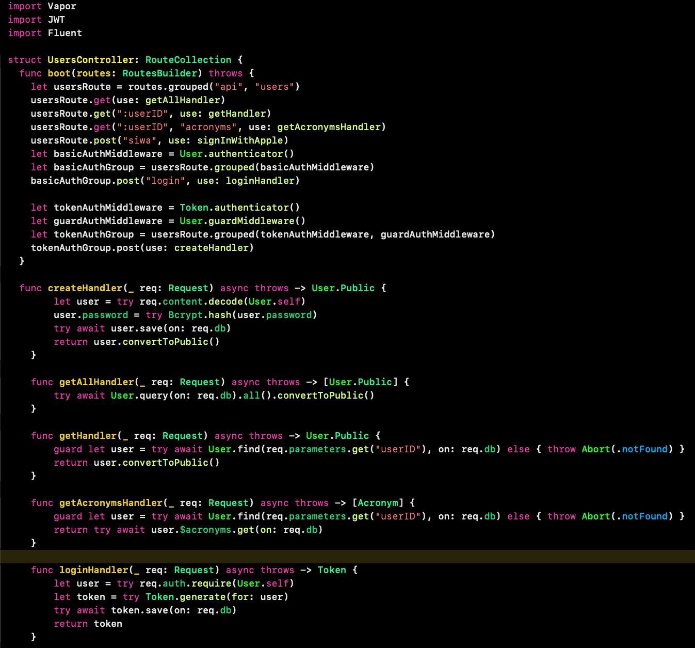
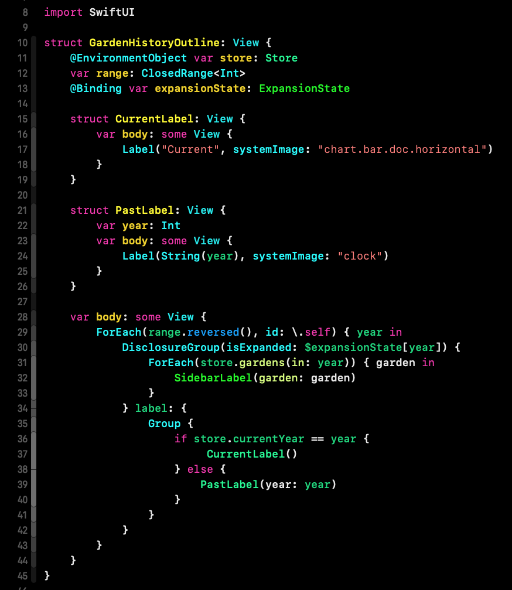

## Changes on the Midnight theme:
* Type Declarations and Other Declarations are in yellow, which is the most stand-out color of the theme. It makes it easier to follow the outline of your code while you scroll through it, especially the method/function definitions.
* The class and type names have a different tone than the method and variable names.
* The red color of the default string always looked like there is an alert. It is now dimmed.
* Terminal text color is green and uses the Iosevka font that is more compact.
* The background color is pure black.

